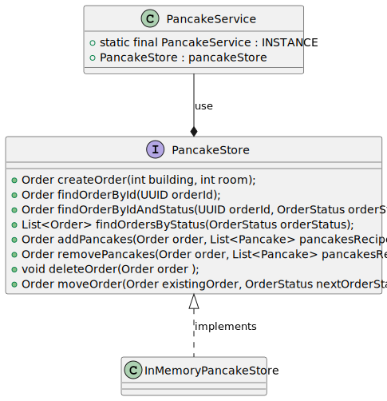

# New PancakeLab 

## Summary

We hope our Sensei enjoys the new PancakeLab application, designed to streamline operations at the Pancake Dojo!

### Major changes

- Customers are now able to choose the ingredients they want among the ones our Sensei approve! our new system will
  - remove duplicates: if you specify Hazelnuts, Hazelnuts, Hazelnuts means you want a pancake with Hazelnuts 
  - generate a consistent name for your Pancake
  - at least one topping is required for the order to be closed
- the persistence management (PancakeStore) has been decoupled by the business logic so,
  when our Dojo will be world-wide, we will be able to replace the InMemory management with a database or our choice
- the InMemory store uses a Map to find quickly orders by Id 
- Concurrency has been addressed:
  - all objects are Immutable, an update will create a new instance of the modified object
  - The PancakeService is a singleton (via Enumerator pattern) and methods that are updating data are synchronized
- our system, now, enforce the workflow our Sensei designed.

## The order workflow

  1. INCOMPLETE: Disciple create order. He/she must specify valid building and room numbers (both positive)
  2. COMPLETED: once all Pancakes have been added and the Disciple set the order as completed. 
     The order goes in the kitchen and cannot be changed anymore. Order without pancakes will not be accepted!
  3. PREPARED: the order is ready for delivery
  4. DELIVERED: The order is delivered to the customer

## Data Structures

### Order

The following diagram shown the data structure for the Order object:

The system supports only toppings approved by Sensei. They are coded in the `Ingredient` enumerator.

A Pancake might be prepared with any combination of the approved Ingredients.
An Order is composed by 

- Address (mandatory) building number and room number
- List of pancakes
- auto generated Description

The builder might generate two concrete class:

- ConcreteOrder: a valid object
- NullOrder: Following the NullObject Pattern report inconsistencies 

### PancakeService and PancakeStore

The following diagram shown the Pancake Service and Store data structure

The interface `PancakeStore` decouple the persistence layer (`InMemoryPancakeStore`) 
by the business logic implemented in the service.

`PancakeService` is a Singleton with synchronized method to enforce concurrency
